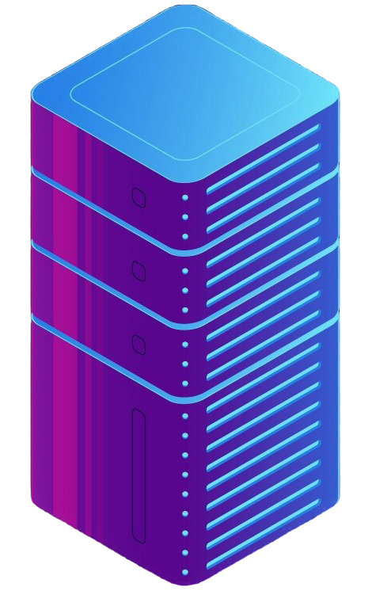
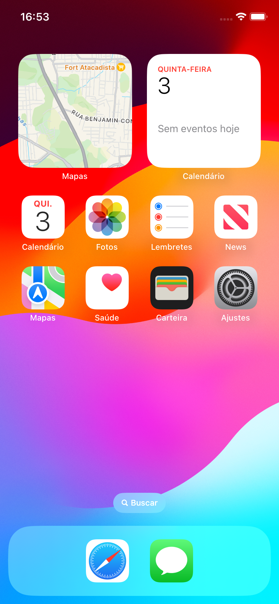

# Bem-vindo à Documentação do Só na Várzea

Esta é a documentação do aplicativo **Só na Várzea**, que oferece uma visão geral de suas funcionalidades e componentes principais.

# Bem-vindo à Documentação do Só na Várzea

Esta é a documentação do aplicativo **Só na Várzea**, que oferece uma visão geral de suas funcionalidades e componentes principais.

## Latest stable version: 1.0

    <!-- Card do Back-end com link para login.md -->
    

        <a href="tela1" style="text-decoration: none; color: inherit;">
            
            <h3>Back-end</h3>
            
Esta seção lida com a lógica de negócios e a comunicação com o banco de dados.

        </a>
    

    <!-- Card do Front-end com link para outra página, por exemplo, planos.md -->
    

        <a href="planos" style="text-decoration: none; color: inherit;">
            
            <h3>Front-end</h3>
            
Esta seção é responsável pela interface do usuário e interação com o aplicativo.

        </a>
    

## Prints do aplicativo

    

        

            

                
                 
                
            

        

        

            

                 
                
                 
            

        

        

            

                
                
                 
            

        

    

    <button class="carousel-button prev" onclick="moveSlide(-1)">&#10094;</button>
    <button class="carousel-button next" onclick="moveSlide(1)">&#10095;</button>

## Descrição

**Só na Várzea** é um aplicativo de gerenciamento de times de futebol varzeano. Ele permite que administradores gerenciem jogadores e jogos, enquanto os jogadores podem acompanhar suas estatísticas e informações sobre o time.

## Introdução

Este aplicativo é projetado para gerenciar times de futebol varzeano. Ele permite aos usuários administrarem jogadores, jogos e informações relevantes do time, além de acompanhar estatísticas individuais.

## Requisitos

### Tecnologias Utilizadas

- Dart SDK: 3.22.0
- Flutter: 3.22.0
- SDK Android API: 34 extensionLevel 7
- Linguagem Level: 21 Record patterns

### Versão

- Atual: 1.0.0

### Nome do Projeto

- **br.com.evolvecap.sonavarzea**

### Plataformas

- Android
- iOS

### Funcionalidades

- Gestão de jogadores e suas estatísticas
- Criação e gerenciamento de jogos
- Notificações para jogadores e administradores
- Sistema de planos de contratação para times

## Contribuição

Se você deseja contribuir, consulte a seção de contribuição da documentação para obter mais detalhes sobre como ajudar.

## Contato

Para mais informações ou suporte, entre em contato com [cristianbrunonecordero@gmail.com].
